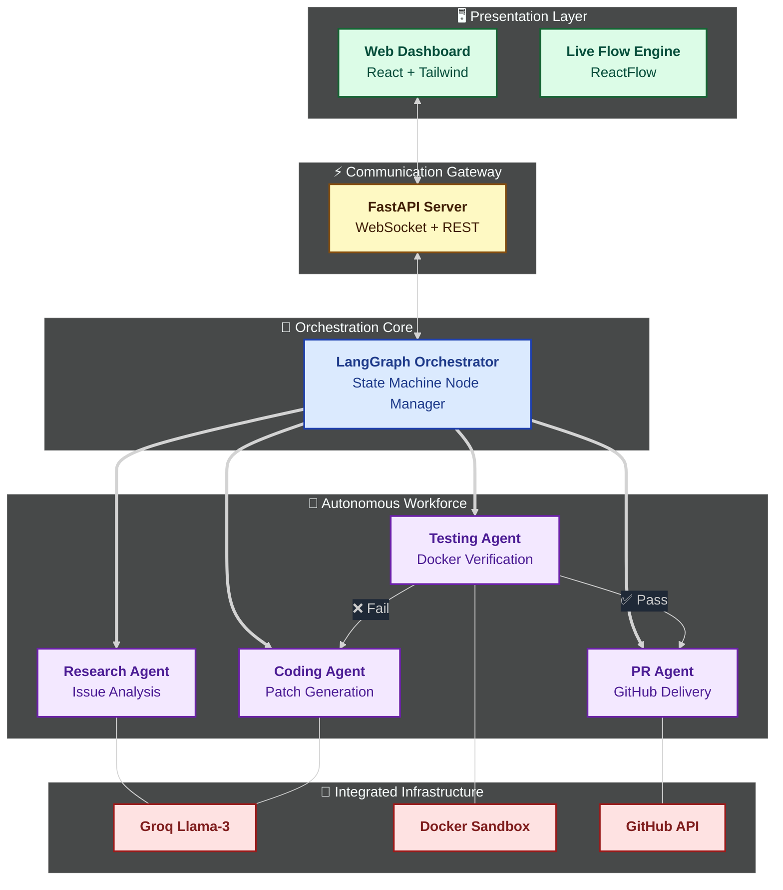

# 🚀 AgentHelix: Autonomous Multi-Agent GitHub Automator

[](https://github.com/prakhar0085/AgentHelix)
[](https://github.com/langchain-ai/langgraph)
[](https://groq.com)
[](https://reactflow.dev/)

**AgentHelix** (AI Orchestration) is a high-performance system that autonomously transforms GitHub issues into verified Pull Requests. By leveraging **LangGraph** to manage agent state and **Llama 3 (via Groq)** for ultra-fast reasoning, it researches, fixes, and tests code in isolated sandboxes with zero human intervention. 

---

## 🏗 System Architecture

AgentHelix is built using a **Feedback-Driven State Machine** pattern. Agents collaborate through a shared persistent state to drive the lifecycle of an issue.



---

## ✨ Key Capabilities

- **🧠 Intelligent Triage**: Deep-dives into repository structure to isolate root causes.
- **🛠 Code Generation**: Patches bugs using Llama-3-70B with strict context injection.
- **🛡 Isolated Sandboxing**: Executes generated code inside **ephemeral Docker containers**.
- **🔄 Iterative Self-Correction**: If tests fail, the "Judge" agent provides feedback, and the system loops until the fix is perfect.
- **📊 Real-time Monitoring**: A beautiful ReactFlow dashboard to watch the agents think and act live.

---

## 🚀 Quick Setup

### 1. Prerequisites
- **Python 3.10+** & **Node.js 18+**
- **Docker Desktop** (Required for test sandboxing)
- **API Keys**: Groq API Key & GitHub PAT (Personal Access Token)

### 2. Backend Installation 🐍
```bash
cd multi-agent-system
pip install -r requirements.txt
cp .env.example .env
# Open .env and add your keys
python main.py --repo <repo_url> --issue <number>
```

### 3. Frontend Dashboard 🎨
```bash
cd frontend
npm install
npm run dev
```

---

## 🤖 The Agent Squad

| Agent | Responsibility | Tooling |
| :--- | :--- | :--- |
| **Research** | Clone repo, identify bug locus, analyze context | GitPython, LLM |
| **Coding** | Generate precise patches for identified files | Groq (Llama-3) |
| **Testing** | Write unit tests and execute in isolated container | Docker, PyTest |
| **PR** | Commit changes, push branch, and open descriptive PR | GitHub API |

---

## 🛡 Security First
- **Zero-Trust Testing**: No tests run on your local machine; they are always jailed within Docker.
- **Memory Caps**: Sandbox containers are resource-limited to prevent abuse.
- **Network Restricted**: Sandboxed containers have no internet access during execution.

---

## 📜 License
Published under the **MIT License**. Created by [tiwar](https://github.com/tiwar).
