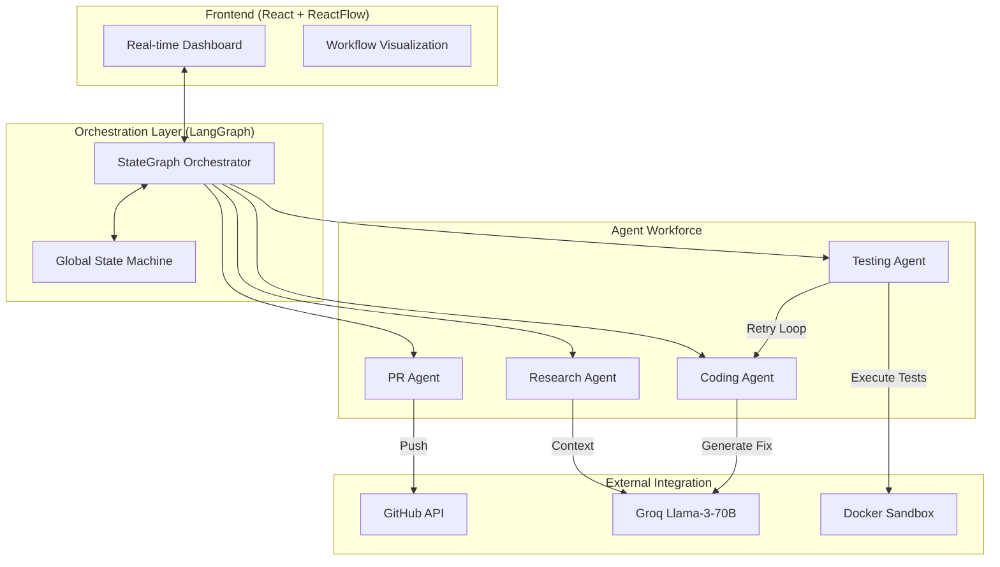

# 🚀 AiOrch: The Future of Autonomous Issue Resolution

[](https://github.com/tiwar/AiOrch)
[](https://github.com/langchain-ai/langgraph)
[](https://groq.com)
[](https://reactflow.dev/)

**AiOrch** (AI Orchestration) is a state-of-the-art multi-agent system designed to bridge the gap between GitHub issues and pull requests. By leveraging **LangGraph** orchestration and **Llama 3 (via Groq)**, it autonomously researches, fixes, and tests code in isolated sandboxes before delivering production-ready PRs.

---

## 🏗 High-Level Architecture

AiOrch's power lies in its specialized agent workforce. Each agent is a dedicated module with precise responsibilities, all governed by a central state machine.



---

## ✨ Key Features

- **🧠 Intelligent Research**: Deep-dives into repositories to find the exact root cause of an issue.
- **🛠 Autonomous Coding**: Generates precise patches and applies them directly to the codebase.
- **🛡 Isolated Sandboxing**: All tests run inside **Docker containers** with restricted network access and resource caps for maximum security.
- **🔄 Self-Correction Loop**: If tests fail, the Coding Agent receives the stack trace and self-corrects the logic—up to 3 times automatically.
- **📊 Live Visualization**: A beautiful ReactFlow-powered dashboard to watch the agents think and act in real-time.
- **🚀 One-Click PRs**: Automatically opens elegant Pull Requests with comprehensive descriptions and testing logs.

---

## 🛠 Tech Stack

| Layer | Technologies |
| :--- | :--- |
| **Backend** | Python, LangGraph, FastAPI, PyGithub, GitPython |
| **LLM Interface** | Groq (Llama 3-70B), LangChain |
| **Sandbox** | Docker Desktop, PyTest |
| **Frontend** | React, Vite, Tailwind CSS, ReactFlow, Framer Motion |
| **Database** | SQLite (for persistence) |

---

## 🚀 Getting Started

### 1. Prerequisites
- **Python 3.10+**
- **Node.js 18+**
- **Docker Desktop** (Engine must be running)
- **Groq API Key** (Free at [console.groq.com](https://console.groq.com))
- **GitHub Token** (Personal Access Token with `repo` scope)

### 2. Backend Setup
```bash
cd multi-agent-system
pip install -r requirements.txt
cp .env.example .env
# Fill in values in .env
python main.py --repo <repo_url> --issue <issue_number>
```

### 3. Frontend Setup
```bash
cd frontend
npm install
npm run dev
```

---

## 🔄 The Agent Workflow

1.  **Search**: `Research Agent` clones the repo and finds the buggy file.
2.  **Think**: `Coding Agent` generates a solution using Llama 3.
3.  **Verify**: `Testing Agent` writes unit tests and runs them in a **Docker sandbox**.
4.  **Refine**: If the sandbox returns an error, it loops back to the Coding Agent with the error logs.
5.  **Deliver**: `PR Agent` commits the fix and opens a Pull Request on GitHub.

---

## 🎨 UI Preview

*(Place your screenshots here for maximum impact)*

> [!TIP]
> Use the **ReactFlow** dashboard for the best experience. It provides a real-time graph view of the agent state transitions, allowing you to debug and monitor complex flows visually.

---

## 📜 License
Published under the **MIT License**. Created by [tiwar](https://github.com/tiwar).
